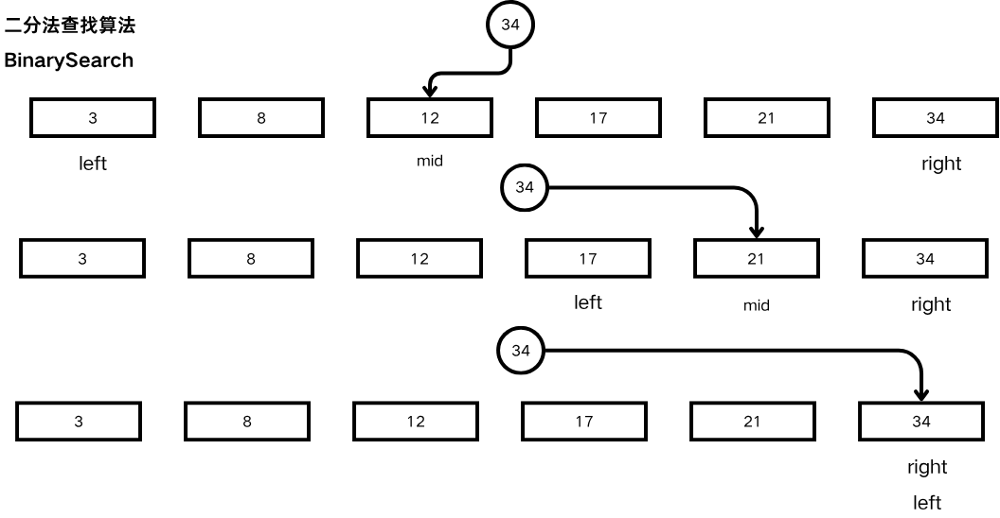

# 二分法查找算法



# 原理

> 有序数组的二分查找数据, 通过不断判断目标key与中间值的大小, 将搜索范围逐渐对半搜索
> 
> 


# 实现代码

```C
int binary_search(int *arr, int size, int target){
    int left = 0;
    int right = size - 1;
    
    while(left <= right){
        int mid = (left+right) / 2;
        if(arr[mid] == target){
            return mid;
        }else if(arr[mid] > target){
            right = mid - 1;
        }else {
            left = mid + 1;
        }
    }
    return -1;
}
```

