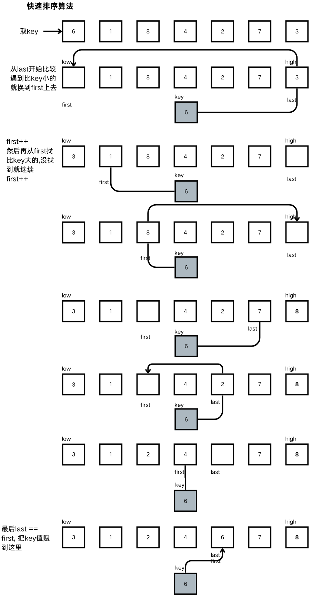

# 快排

# 原理

> 首先找到一个key值\. 然后排序, key值的左边 全放比key小的\. 右边放比key值大的\.
> 
> 然后依次递归\.直到只剩下一个值\.
> 
> 





# 代码

```C
void quick_sort(int *arr, int low, int high){
    if(low >= high){
        return;
    }
    int key = arr[low];
    int first = low;
    int last = high;
    
    while(first != high){
        while(first != high){
            if(arr[last] < key){
                arr[first] = key;
                ++first;
                break;
            }else{
                --last;
            }
        }
        while(first != high){
            if(arr[first] > key){
                arr[last] = arr[first];
                first++;
                break;
            }else{
                --first;
            }
        }
    }
    arr[first] = key;
    
    quick_sort(arr, low, first-1);
    queic_sort(arr, first+1, high);
    return ;
}
```

