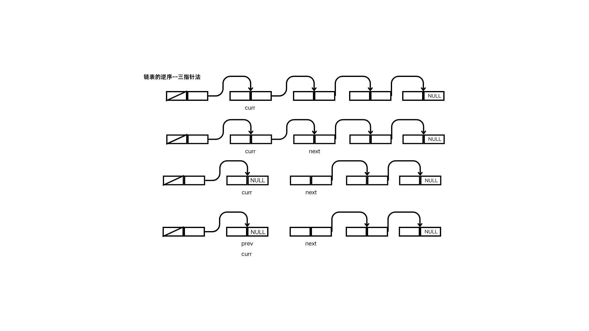
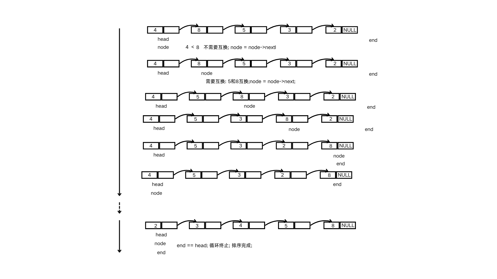
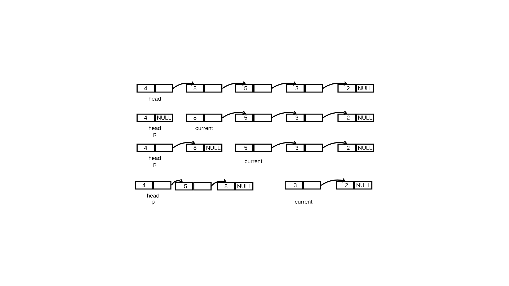
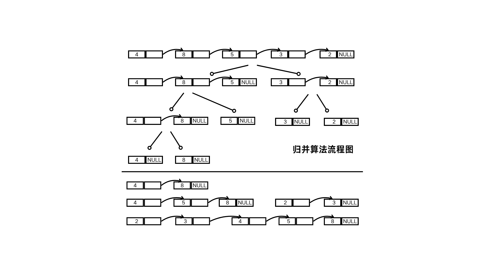

# 链表复杂操作

# 链表的逆序

## 三指针法



> 定义三个指针 prev current next, 初始化时current指向第一个有数据节点\. prev next为NULL
> 
> 理解难度偏高
> 
> 

```C
// 以有头节点的链表为例
Node * reverse_linkList(Node * head)
{
    if(head == NULL){
        return NULL;
    }
    Node * current = head;
    Node * prev = NULL;
    Node * next = NULL;
    
    while(current != NULL)
    {
        next = current->next;
        current->next = prev;
        prev = current;
        current = next;
    }
    
    return prev;
}

//调用
head->next = reverse_linkList(head->next);
```

## 头插法


> 从头数据节点后 先断开\. 后续一次从头开始插入
> 
> 

```C
int reverse_linkList_insert(Node * head)
{
    if(head == NULL || head->next == NULL){
        return -1;
    }
    
    Node * current = head->next->next;
    head->next->next = NULL;
    while(current != NULL)
    {
        Node * nextTemp = current->next;
        current->next = head->next;
        head->next = current;
        current = nextTemp;
    }
    return 0;
}
```


# 链表的排序

## 冒泡



> 有一个队尾指针, 每次循环完成后, 会把end推进直到头指针\.
> 
> 依次和后一个节点数据比较, 如果前节点比后节点大, 就互换data\.
> 
> 

```C
int sort_linkList_bubble(Node * head)
{
    if(head == NULL || head->next == NULL)
    {
        return -1;
    }
    Node *node = NULL;
    Node *end = NULL;
    while(head!=end)
    {
        node = head;
        while(node->next!=end)
        {
            if(node->data > node->next->data)
            {
                DataType temp = node->data;
                node->data = node->next->data;
                node->next->data = temp;
                
            }
            node = node->next;
        }
        end = node;
    }
    return 0;
}
```

## 头插法排序



> 单独分出一个单链表, 然后依次遍历, 找到节点比它大的,就在之前插入\.
> 
> 

```C
// 有头节点的
int sort_linkList_inser(Node * head)
{
    Node * current = head->next->next;
    head->next->next = NULL;
    while(current != NULL)
    {
        Node * p = head;
        
    }
}
```


## 归并算法

逻辑比较难理解

> 递归二分: 分到最后成单节点, 然后就是两个有序链表的合并操作
> 
> 




```C
void merge_sort_linkList(Node * head)
{
    if(head == NULL)
    {
        return ;
    }
    
    head->next = sub_merge_sort_linkList(head->next);
    return ;
}

Node * sub_merge_sort_linkList(Node* head)
{
    if(head==NULL)
    {
        return NULL;
    }
    if(head->next == NULL)
    {
        return head;
    }
    Node * slow = head;
    Node * fast = head->next;
    Node * mid = NULL;
    
    while(fast!=NULL && fast->next!=NULL)
    {
        slow = slow->next;
        fast = fast->next->next;
    }
    
    mid = slow->next;
    
    Node * left = sub_merge_sort_linkList(slow);
    Node * right = sub_merge_sort_linkList(mid);
    
    return merge_two_list(left, right);
}

Node * merge_two_list(Node * left, Node * right)
{
    if(left == NULL || right == NULL)
    {
        return NULL;
    }
    
    Node dummy;
    Node * temp = &dummy;
    temp->next = NULL;
    while(left != NULL && right != NULL)
    {
        if(left->data < right->data)
        {
            temp->next = left;
            left = left->next;
        }else{
            temp->next = right;
            right = right->next;
        }
        temp = temp->next;
    }
    if(left!=NULL){temp->next = left;}
    if(right!=NULL){temp->next = right;}
    
    return dummy.next;
}
```


# 环链表判断

> 用快慢针来判断, 如果是环链表, fast 迟早追上slow, 否则就会遇到NULL\.
> 
> 

```C
bool is_circle_linkList(Node * head)
{
    if(head==NULL || head->next == NULL)
    {
        return false;
    }
    
    Node * slow = head;
    Node * fast = head;
    
    while(fast!=NULL && slow!=NULL)
    {
        if(fast == slow)
        {
            return true;
        }
    }
    
    return false;
}
```


